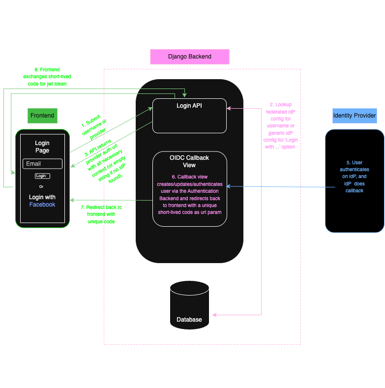

# FEDAUTH

## Terminology:

- **Federated OIDC**:

    Refers to login flows where the username or email domain is associated with a specific organization that uses its own OIDC Identity Provider. The package retrieves the appropriate OIDC configuration by looking up the user's domain in the database.

- **Generic OIDC**:

    Refers to non-domain-specific login options typically shown as "Login with {Provider}" (e.g., "Login with JumpCloud"). These are explicitly selected by the user and not determined based on their email domain.

# Overview

This package enables any Django project to support both **federated** and **generic** OIDC logins for the admin login page, and also provides APIs for frontend OIDC authentication.

It's an OpenID Connect authentication package with support for multiple identity providers, all configurable via the database.

This package is built on top of [`mozilla-django-oidc`](https://mozilla-django-oidc.readthedocs.io/en/stable/).

You can find all applicable `mozilla-django-oidc` configuration options [here](https://mozilla-django-oidc.readthedocs.io/en/stable/settings.html).

# This package has two main OIDC flows:

## A) Django Admin OIDC (Federated or Generic OIDC)

## A) Frontend API OIDC (Federated or Generic OIDC)

# TODO: request/response bodies
# TODO: OIDC setup
# TODO: customization (custom idp, templates etc)
# TODO: flow diagrams

## License

This project is **not open source** (yet).

It is shared under a proprietary license for educational and portfolio purposes only.

View-only rights are granted. **No reuse, distribution, or commercial use is permitted.**  
See the LICENSE file for full terms.