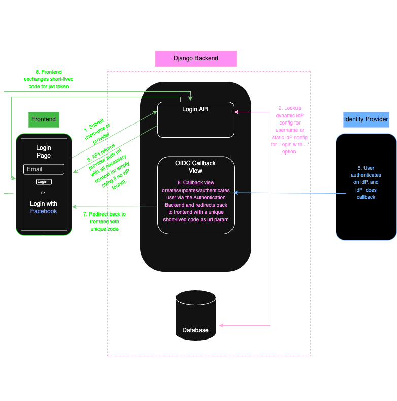
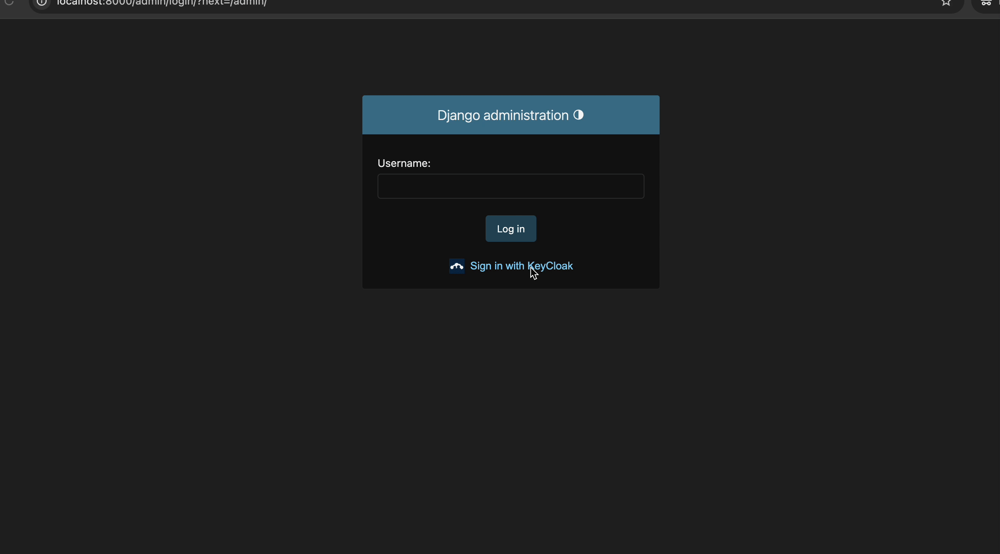

# FEDAUTH

[](https://codecov.io/gh/Wynand91/fedauth)


## Table of Contents

- [Overview](#overview)
- [Installation](#installation)
- [Flow diagrams](#flows-diagrams-)
- [IDP setup for local testing](#idp-setup-for-local-testing)
- [Admin OIDC setup](#admin-oidc-setup)
- [Demo: Admin OIDC](#admin-demo)
- [Frontend OIDC API setup](#frontend-oidc-api-setup)
- [Demo: Frontend OIDC](#frontend-api-demo)
- [Example 'settings.py'](#settingspy-example)
- [Example 'urls.py'](#url-registration)
- [Template customization](#customizing-admin-login-template)
- [License](#license)

Requirements:
 - python 3.11+
 - django >= 4.2, < 5.0

# Overview

Fedauth is a Django package that enables federated admin logins using OpenID Connect (OIDC). The package supports a 
multi-tenant federated authentication flow, allowing different organizations (clients) to log into the django admin via their own 
identity providers (IdPs), while also supporting a default login method for internal users.

This package is built on top of [`mozilla-django-oidc`](https://mozilla-django-oidc.readthedocs.io/en/stable/).

You can find all applicable `mozilla-django-oidc` configuration options [here](https://mozilla-django-oidc.readthedocs.io/en/stable/settings.html).


## Terminology

- **idP**: 

    Identity Provider


- **Dynamic Flow**:

    Refers to login flow where the idP is inferred from the username/email submitted on login form. The package retrieves the appropriate OIDC configuration by looking up the user's domain in the database.


- **Static FLOW**:

    Refers to non-domain-specific login options typically shown as "Login with {Provider}" (e.g., "Login with JumpCloud"). These are explicitly selected by the user and not determined based on their email domain.

## Features:

Django Admin:
- **Dynamic Admin OIDC login**:

    Django Admin login form accepts username (email), and is automatically redirected to Identity Provider login page if their email domain is found in the 
Dynamic Provider table. If not found in the table, the user is asked to submit a password (default login)


- **Static Admin OIDC login**:

    Any static Identity Provider Login option can be added to the django login page (e.g. "Login with JumpCloud").  Static provider configs are stored in the
Static Provider table.

APIs:
- **Dynamic OIDC login endpoint**:

    The package includes a login endpoint that can be used by any frontend agent to login based on a federated username (email) 


- **Static OIDC login endpoint**:

    This endpoint can be used to retrieve any provider auth URL.  Static provider configs are stored on the
Static Provider table. By using this endpoint, any Identity Provider Login option can be added to the frontend 
login page (e.g. "Login with Google") without having to store any provider configurations on the individual frontends. 

# Installation
To install, run:

    pip install git+https://github.com/Wynand91/fedauth.git


# Flows diagrams: 
diagrams done with [draw.io](https://www.drawio.com/)

## A) Django Admin OIDC (Dynamic or Stativ OIDC)


## A) Frontend API OIDC (Dynamic or Static OIDC)



# IDP setup for local testing

In order to use the package, the user needs to set up developer accounts for their preferred providers. Basically any 
provider can be used, since they all have the same flow. 

**Disclaimer**: Dashboards on these OIDC provider accounts regularly change, so it is up to the user to find documentation 
on how to set up their providers.

Below is what configurations you will need, regardless of provider, in order to use the package:
  
 - What you'll need to create the provider objects in admin:
   - Client ID
   - Client secret
   - Endpoints
     - Authentication URL
     - Token URL
     - User info URL
     - JWKS urls (or 'certs' for some providers - same thing)
     

 - Configurations that have to be done on IDP dashboard:
   - Create Users on provider dashboard
   - You need to configure "admin" and "superuser" **groups**, and then add the groups **scope** to the token payload, so that the callback 
method can assign user permissions based on the groups they belong to. This can be a tricky step that requires lots of 
debugging if not set up correctly.

### Here are a few recommended providers with setup instructions:

> Note: For easiest setup I recommend: 
>- 'KeyCloak' for federated user login (Dynamic and/or Static)
>- 'Google' for non-federated user frontend login ('Login with google')

**KeyCloak** (*Easiest to set up*): [KeyCloak setup](docs/keycloak_setup.md)
- Runs locally using docker (required).
- Offers federated user functionality, and groups scope setup

**Okta** (*More complex to set up*): [
Okta setup](docs/okta_setup.md)
- Okta developer account requires a domain email address (can't use '@gmail.com' or '@yahoo.com' email)
- Offers federated user functionality, and groups scope setup

**Google** (*Relatively simple setup*): [Google setup](docs/google_setup.md)
- **DOES NOT** offer federation capabilities (Can't assign group scopes)
- **ONLY** use for frontend API testing (Static login options on frontend)
- Use this for static sign in setup ('Sign in with google')

> ## Note: Handling idP sessions
> 
> Once you've authenticated a user via idP, your browser will have an open session with the idP client 
> (like when being logged in to your gmail account - the browser will always use the logged in session to authenticate when you select "log in with Google" on any service.)
> 
> This Means that if you log out of the admin, the idP session persists, and if you submit your email again, you will be logged 
> in instantly, since there is open a session. But when another user submits an email, it will just log in the first user.
> 
> You have two options to work around this when testing different users:
> 1. On KeyCloak dahsboard, go to 'sessions' panel, and close the session of the user.
> 2. Or use Incognito window for every different user.


# Admin OIDC setup

- Dynamic login
  - When using this package, the admin login form will only ask for a username (email)
  - When the username is submitted, the backend will check the email domain, and redirect the user to the auth provider if the 
domain is found in the DynamicProvider table.
  - If domain is not found, the admin will show a login from including a password field to handle default login.
  - see this doc for instructions: [Dynamic admin login](docs/dynamic_admin.md)

- Static login
  - You also have the option of adding a e.g. 'Login with ...' option
  - see this doc for instructions: [Static admin login](docs/static_admin.md)

## Admin Demo:

> Note: I am using KeyCloak idP service for both dynamic and static login here, but any Auth provider that allows for federated users, can be used.

### Dynamic admin login (idP inferred from username domain)


### Static admin login ('Login with ...' selected) 



# Frontend OIDC API setup

- This package provides two login endpoints:
  - `/login/` - to get idP auth url
  - `/login/token-exchange/` - to exchange the short-live code for a valid JWT token

- See this doc for usage: [Fronted OIDC API](docs/api_strucure.md)

## Frontend API Demo:

### Dynamic API login (idP inferred from username domain)


### Static admin login ('Login with ...' selected) - Note, I am already logged into my google account here, so I don't have to authenticate

 
# `settings.py` example

 - This package requires some configurations on your `settings.py` file
 - See example: [example settings](docs/settings_example.md)

# URL registration

- Below is an example of how to register fedauth urls
```python
urlpatterns = [
    # include fedauth admin urls before standard admin
    path('admin/', include('fedauth.oidc_admin.urls')),
    path('admin/', admin.site.urls),
    # register fedauth auth urls (authentication, callback and logout url)
    path('oidc/', include('fedauth.urls')),
    # include any static oidc providers if using any on admin login form
    path('jumpcloud/authenticate/', JumpCloudAuthRequestView.as_view(), name="jumpcloud_authentication_init",),
    path('', include(api_urls)),
]
```

## Customizing Admin login template:
- This package has a default login template called `admin/oidc_login.html`
- To customize this template (if specific styling is required, or to add static provider login links), a custom login template can be created that either 
extends the custom template or completely overrides it.
- If a custom template is created, add the following setting to settings file: `LOGIN_TEMPLATE = '<template>'`
- NOTE: **username** should be the ONLY form field on template.


## License

This project is **not open source** (yet).

It is shared under a proprietary license for educational and portfolio purposes only.

View-only rights are granted. **No reuse, distribution, or commercial use is permitted.**  
See the LICENSE file for full terms.